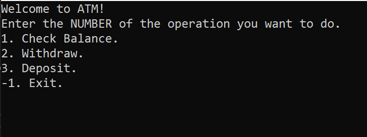

# Welcome to ATM project!

## You can do three major operations:

1. View Your Balance.

2. Withdraw
	1. You can not withdraw more than your balance
	2. You can not withdraw minus values.

3. Deposite
	1. You can not deposit less than ONE dollar.

> And there is a bunch of unit test cases for these operations.

## Interface of the program

> Choose one of the three the operation above

> The program will ask you for the amount.

> You have to insert numerical values, otherwise it will throw an exception.

